# Free Real Estate Monorepo

> [!NOTE]
> This project is under active development.

Real Estate company demo website and testing ground for numerous backends.

So far, I am working with Drizzle and SQLite, although I expect to use Prisma with MongoDB, and Golang too.

This present document serves as a General Design Document.

## 1. Project Structure

The project is structured as a **monorepo** managed by `pnpm` workspaces.

A general overview of its current state:

```mermaid
graph TD
    subgraph FE ["Frontend"]
        UI[UI Components]
        Components("`Geographic Maps
        Property Listing
        **User Interactions**`")
    end

    subgraph BE ["Backend"]
        API[Hono REST API]
        ORM[Drizzle ORM]
    end

    subgraph SH ["Shared Package"]
        Schema[Database Schema]
        Types[Shared Data Types]
    end

    DB[(SQLite Database)]

    %% Runtime Data Flow
    Components ==> UI
    UI <== "Fetch / JSON" ==> API
    API <== "Queries" ==> ORM
    ORM <== "SQL" ==> DB

    %% Source of Truth Logic
    Schema -- "Defines" --> ORM
    Schema -- "Infers" --> Types
    Schema -- "Syncs / Migrates" --> DB

    Types -- "Type Safety" --> UI
    Types -- "Type Safety" --> API

    %% Subgraphs
    style FE fill:#1f1f1f,stroke:#202036,stroke-width:2px
    style BE fill:#1f1f1f,stroke:#202036,stroke-width:2px
    style SH fill:#1f1f1f,stroke:#202036,stroke-width:2px

    %% Lighter Node
    style UI fill:#3f3f3f,stroke:#909090,color:#f5f5f5
    style Components fill:#3f3f3f,stroke:#909090,color:#f5f5f5
    style API fill:#3f3f3f,stroke:#909090,color:#f5f5f5
    style ORM fill:#3f3f3f,stroke:#909090,color:#f5f5f5
    style Schema fill:#3f3f3f,stroke:#909090,color:#f5f5f5
    style Types fill:#3f3f3f,stroke:#909090,color:#f5f5f5
    style DB fill:#3f3f3f,stroke:#909090,color:#f5f5f5
```



The main parts consist of what follows (dependencies and their web links are listed in their respective README documents):

### 1.1 Frontend

#### 1.1.1 Framework

The frontend is designed to be a modern web application built with `React Router v7`.

It was decided to organize `React` components simply in `/frontend/app/components/*` and `/frontend/app/components/*/*`, where subdirectories respect to different routes.

#### 1.1.2 Styling

With `Tailwind CSS v4` We utilize a custom theme and general reset that extends `preflight` along with utility classes.

#### 1.1.3 Maps

`React-leaflet` is used for interactive property maps that support adding markers. These are basically `open street maps` with some extra functionality.

#### 1.1.4 State Management

React Router's `loader` and `action` patterns are used for data fetching and mutations, minimizing the need for global state libraries.

This extends to transient UI state that would otherwise live in `useState`. We use URL parameters for filtering the real estate properties and chat conversations, with the one currently open in the chat panel being held in the URL as a `?chat=<id>` search parameter, which lets the route `loader` fetch the thread on the server, survives a page reload, and makes a given conversation linkable.

Chats are kept fresh by re-running the active loaders on an interval (see [usePollingRevalidation](/frontend/apps/hooks/usePollingRevalidation.ts)) rather than by a socket.

#### 1.1.5 Previews of the frontend:

<details>

<summary>Open the screencaptures</summary>

##### Homepage:


##### Properties:


##### About:


##### Contact:


##### Our Agents:


##### Profile / Chats:


</details>


### 1.2 Backends

#### 1.2.1 Drizzle

RESTful API built with `Hono`, using `Drizzle` ORM.

The runtime is `Node.js` via `@hono/node-server`.

- **Endpoints**:
  - _Properties_:
    - `GET /api/properties`: Supports filtering (price, type, location, etcetera).
    - `GET /api/properties/:id`: View of a single listing.
    - `GET /api/cities`: Gets unique cities for search suggestions on user inputs.
  - _Authentication_:
    - `POST /api/auth/register`: User registration.
    - `POST /api/auth/login`: User login (sets session cookie).
    - `POST /api/auth/logout`: User logout (clears session cookie).
    - `GET /api/auth/me`: Verifies currently authenticated user session and retrieves the full user's profile.
  - _Users & Bookmarks_:
    - `GET /api/users`: Gets list of user agents (not normal users, as this is for Our Agents page).
    - `GET /api/users/:id`: Gets profile details of a specific user.
    - `PUT /api/users/:id`: Updates a user's profile (name, profile picture, biography, etc).
    - `PUT /api/users/:id/password`: Updates a user's password, including verification with Argon2.
    - `POST /api/users/:id/promote`: Promotes a normal user to Agent status using a secret code.
    - `GET /api/users/:id/properties`: Gets properties owned by a user.
    - `GET /api/users/:id/bookmarks`: Gets a user's bookmarked properties.
    - `POST /api/users/:id/bookmarks`: Saves a property to a user's bookmarks.
    - `DELETE /api/users/:id/bookmarks/:propertyId`: Removes a property from a user's bookmarks.
  - _Chats & Messages_:
    - `GET /api/chats`: Gets the authenticated user's conversations, most recently active first, each with its counterpart, property, last message and unread count.
    - `GET /api/chats/unread-count`: Counts the distinct people with unread messages, which is what the notification badge displays.
    - `GET /api/chats/:id/messages`: Gets a single conversation with its full message history.
    - `POST /api/chats`: Opens the conversation with an agent about one of their properties, reusing an existing one if it exists.
    - `POST /api/chats/:id/messages`: Posts a message into a conversation.
    - `POST /api/chats/:id/read`: Marks a conversation as read up to the present moment.

##### 1.2.1.1 Core Database Entities

- **Users**: Represents real estate agents and their clients. It stores identity and profile information.
- **Properties**: The central entity. It stores listing details, location (latitude/longitude), pricing and media (images, galleries).
- **Posts**: Blog or news entries for the platform.
- **Chats, Chat Participants & Messages**: Persistent conversations between a user and an agent. Every chat is scoped to one property, so a conversation always has a subject; participants are a many-to-many join table that also carries each side's `lastReadAt` read watermark, from which unread counts are derived without storing per-message read flags.
- **Bookmarks**: Users are able to save favorite properties to look up later from their respective profile pages.

##### 1.2.1.2 Schema Implementation

We use `Drizzle`.

JSON fields are used to store complex data like image galleries and nearby places within the SQLite database without requiring a whole new set of tables. There is a neat helper for this thanks to Drizzle's custom types.

### 1.3 Shared

A central package containing the database schema and TypeScript types, ensuring consistency across both aforementioned sub-repositories as the single source of truth; these are shared as a local dependency under the name of `@free-real-estate/shared`.

## 2. Running the Project

As of now, one could clone the repository and add a `.env` file at `/backends/node-drizzle/` with the following:

```
DB_FILE_NAME=file:local.db
```

Then run:

```bash
pnpm install

pnpm push:be && pnpm seed:be && pnpm run dev
```

**⌃** This:

1. Creates database tables according to the [schema](/shared/src/schema.ts).
2. Seeds the tables, for which you want to be using a Linux (or Unix) filesystem or check the **linked** [general data file](/backends/node-drizzle/src/db/generalDataSeed.ts) for compatibility with a different type of which.
3. To then start both the backend and frontend servers in parallel. Consult the [main package file](/package.json) for more commands to run from the root of the project.

## 3. Future Considerations

In order of relevant importance:

- **Session Refresh Concurrency**: Refresh token rotation currently misbehaves when a single route loader fires several authenticated requests in parallel. The problem, the mitigation in place and the candidate fixes are documented in [the refresh token rotation document](/docs/REFRESH_TOKEN_ROTATION_CONCURRENCY.md).
- **Agents Adding new Property Listings**: Agents should be able to create, edit and remove new properties from their profile.
- **Messaging System**: What remains could be making delivery real-time instead of polled, plus niceties such as an emoji picker, attachments, ability to edit and delete messages, and typing indicators.
- **Blogs**: A blog feature with rich text support. I am delaying this for a good while.
- **Backend Diversification**: Implementing the same API specifications in Go to compare performance and developer experience could be very interesting from a certain perspective.
